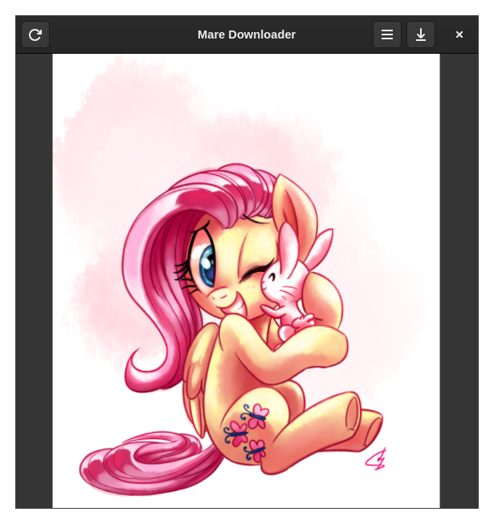

# MareDownloader
A GTK4 application that downloads images of mares based on https://derpibooru.org


Fluttershy by lightof-dawn

# Instalation
## Configure

```bash
meson setup build
```
or if you want to install for local user
```bash
meson setup --prefix=~/.local build
```

## Compile and install

```bash
cd build
ninja
meson install
```
